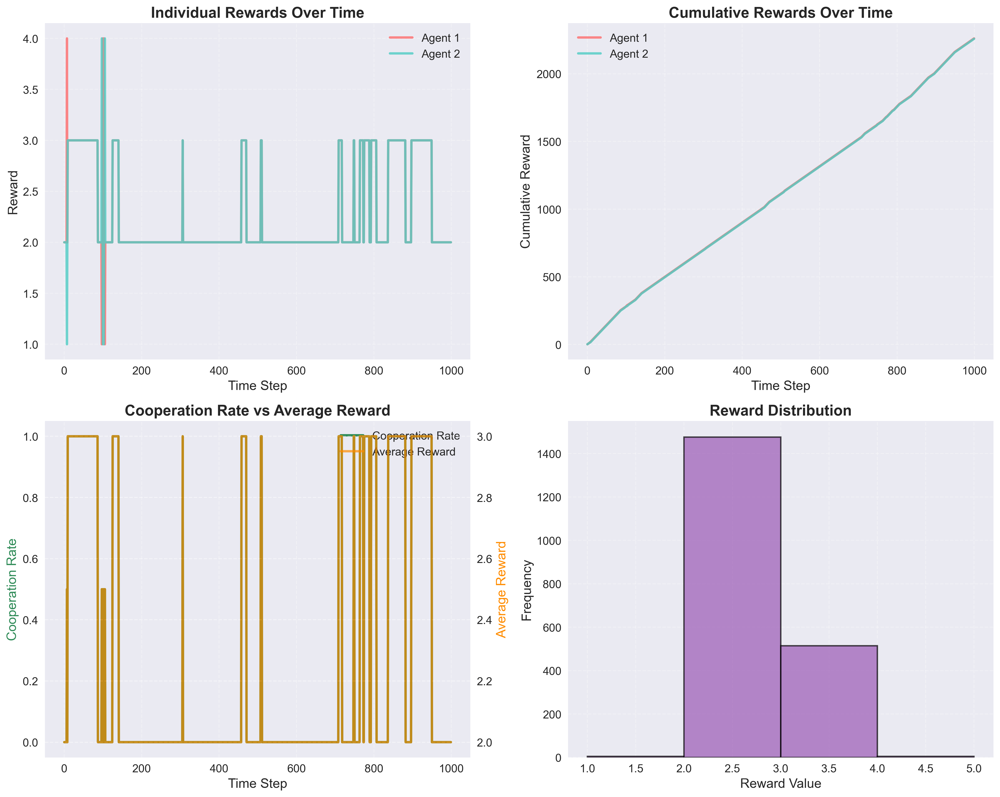

# Prisoner's Dilemma Simulation with Active Inference

A simulation framework for studying the Prisoner's Dilemma using active inference agents. The project explores how agents with different learning rates and parameters evolve their strategies over time, both in pairwise interactions and in network settings.

## Overview

The Prisoner's Dilemma is a fundamental game theory problem that explores cooperation vs. defection strategies. This implementation uses active inference agents that learn and adapt their strategies based on their interactions with other agents.

### Key Features

- **Active Inference Agents**: Agents that use Bayesian inference to learn about their environment and other agents
- **Network Simulations**: Multi-agent simulations on network topologies
- **Parameter Sweeps**: Systematic exploration of learning rates and other parameters
- **Comprehensive Visualization**: Multiple plot types for analyzing agent behavior
- **Modular Design**: Clean, well-organized code structure

## Project Structure

```
src/
├── models/                 # Core agent and network models
│   ├── agent.py           # Prisoner's Dilemma agent implementation
│   └── network.py         # Network-based simulations
├── simulation/            # Simulation and parameter sweep modules
│   └── sweep.py          # Parameter sweep functionality
├── visualization/         # Plotting and visualization
│   └── plots.py          # Comprehensive plotting functions
├── main.py               # Main script to run all simulations
└── dual_agent_results/   # Legacy results and analysis
```

## Installation

1. Clone the repository:
```bash
git clone <repository-url>
cd prisoners-dilemma
```

2. Install dependencies:
```bash
pip install numpy matplotlib networkx pymdp imageio
```

## Usage

### Running All Simulations

To run all simulations and generate all figures:

```bash
cd src
python main.py
```

This will create:
- `figures/` directory with all generated plots
- `results/` directory with simulation data

### Individual Simulations

You can also run specific simulations:

```python
from models.agent import construct_agents, DualAgentSimulation
from visualization.plots import SimulationVisualizer

# Create agents
agent_1, agent_2, D = construct_agents(lr_pB_1=0.1, lr_pB_2=0.1)

# Run simulation
sim = DualAgentSimulation(agent_1, agent_2)
results = sim.run_simulation(T=1000)

# Create plots
visualizer = SimulationVisualizer("my_figures")
visualizer.plot_action_evolution(results['actions'])
```

## Simulation Results

### Agent Actions Over Time


The evolution of agent cooperation over time. The top panel shows individual agent cooperation levels, while the bottom panel displays the overall population cooperation rate. Agents demonstrate learning dynamics as they adapt their strategies based on interactions.

### Strategy Analysis Heatmap


Temporal patterns of cooperation strategies. The left panel shows cooperation patterns over time using sliding windows, while the right panel displays the correlation matrix between agent strategies, revealing how coordinated or independent their behaviors are.

### Reward Analysis



Comprehensive reward analysis including:
- **Individual Rewards**: How each agent's rewards change over time
- **Cumulative Rewards**: Total accumulated rewards for each agent
- **Cooperation vs Reward**: Relationship between cooperation rate and average rewards
- **Reward Distribution**: Histogram showing the frequency of different reward values

### Network Visualization


Network topology (left) and degree distribution (right) with detailed statistics. The network structure influences how strategies spread among agents in multi-agent simulations.

### Comparison Analysis


How different learning rate and precision parameter combinations affect:
- **Cooperation Rate Evolution**: How cooperation develops over time with diverse parameters
- **Final Cooperation Rates**: End-state cooperation levels across different scenarios
- **Convergence Times**: How quickly strategies stabilize with different learning dynamics
- **Average Cumulative Rewards**: Long-term performance metrics

### Learning Dynamics Analysis


How different initial conditions and learning parameters affect strategy evolution:
- **Initial Conditions Impact**: How starting states (cooperative vs. defecting) influence long-term behavior
- **Individual Strategy Evolution**: How each agent's strategy develops over time
- **Reward Dynamics**: How average rewards change with different learning scenarios
- **Strategy Stability**: Which parameter combinations lead to more stable strategies

## Key Findings

### Learning Rate and Precision Effects

Several important patterns emerge:

1. **Very Low Learning Rates (0.01)**: Agents converge slowly and may get stuck in suboptimal strategies
2. **High Learning Rates (0.5)**: Agents adapt quickly but may oscillate between strategies, especially with high precision
3. **Precision Parameter Impact**: High precision (α=10) leads to more deterministic behavior, while low precision (α=0.1) creates more exploration
4. **Asymmetric Learning**: When agents have different learning rates, complex dynamics emerge with the faster learner often influencing the slower one
5. **Initial Conditions Matter**: Starting states significantly impact long-term strategy evolution

### Cooperation Dynamics

- **Initial Phase**: Agents explore different strategies based on their initial conditions and precision parameters
- **Learning Phase**: Agents begin to learn from their interactions, with learning rate determining adaptation speed
- **Convergence Phase**: Agents settle into stable strategies, with precision parameters affecting stability
- **Cooperation Emergence**: Cooperation can emerge under various conditions, but the path depends heavily on learning rates and initial conditions
- **Strategy Oscillations**: High learning rates with high precision can lead to oscillatory behavior rather than stable cooperation

### Network Effects

In network simulations:
- **Clustering**: Agents in dense network regions tend to adopt similar strategies
- **Influence Propagation**: Strategies spread through the network over time
- **Network Topology**: Different network structures (Erdős-Rényi, scale-free, etc.) lead to different cooperation patterns

## Parameter Sweep Results

### Cooperation Rate Heatmap

Different learning rate combinations affect cooperation:

- **High-High Learning Rates**: Often lead to rapid convergence but lower cooperation
- **Low-Low Learning Rates**: Slower convergence but potentially higher cooperation
- **Asymmetric Learning Rates**: Can lead to exploitation dynamics

### Convergence Time Analysis

Convergence time varies significantly with learning rates:
- Fast learners converge quickly but may not find optimal strategies
- Slow learners take longer but may achieve better long-term outcomes

## Technical Details

### Active Inference Framework

The agents use the active inference framework, which includes:

1. **State Inference**: Agents infer the current state of the game
2. **Policy Selection**: Agents choose actions based on expected free energy
3. **Learning**: Agents update their transition models based on experience
4. **Action Sampling**: Actions are sampled from policy distributions

### Reward Structure

The Prisoner's Dilemma reward structure:
- **Both Cooperate**: (3.5, 3.5) - Mutual cooperation
- **Agent 1 Cooperates, Agent 2 Defects**: (0.5, 4.5) - Sucker's payoff
- **Agent 1 Defects, Agent 2 Cooperates**: (4.5, 0.5) - Temptation
- **Both Defect**: (1.5, 1.5) - Mutual defection

### Transition Matrices

Agents learn transition matrices that model how their actions affect the game state. These matrices evolve over time as agents learn from their interactions.

## Extending the Simulation

### Adding New Agent Types

Extend the `PrisonersDilemmaAgent` class:

```python
class CustomAgent(PrisonersDilemmaAgent):
    def __init__(self, custom_param, **kwargs):
        super().__init__(**kwargs)
        self.custom_param = custom_param
    
    def custom_method(self):
        # Custom behavior
        pass
```

### New Network Topologies

Extend the `NetworkSimulation` class:

```python
def _create_custom_network(self):
    # Create custom network topology
    return custom_network
```

### Additional Metrics

Extend the `SimulationVisualizer` class:

```python
def plot_custom_metric(self, data, save_name="custom_metric.png"):
    # Create custom plot
    pass
```

## Contributing

1. Fork the repository
2. Create a feature branch
3. Make your changes
4. Add tests if applicable
5. Submit a pull request

## License

This project is licensed under the MIT License - see the LICENSE file for details.

## Citation

If you use this code in your research, please cite:

```bibtex
@software{prisoners_dilemma_simulation,
  title={Prisoner's Dilemma Simulation with Active Inference},
  author={Your Name},
  year={2024},
  url={https://github.com/yourusername/prisoners-dilemma}
}
```

## Acknowledgments

- Active inference framework based on the work of Karl Friston
- Network analysis using NetworkX
- Visualization using Matplotlib
- Simulation framework inspired by pymdp library

## Contact

For questions or contributions, please open an issue on GitHub or contact the maintainers.
